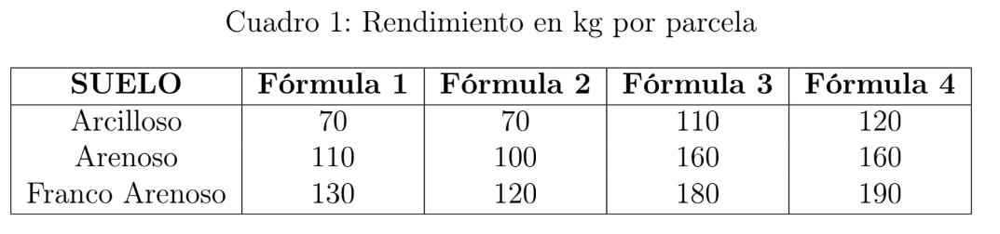

# DISEÑO BLOQUE COMPLETO AL AZAR

## EJEMPLO: RENDIMIENTO DE PAPA PERUANA CON DIFERENTES FÓRMULAS DE FERTILIZANTE

Se realizó un experimento para determinar si existe alguna diferencia en el rendimiento de papa variedad peruana con 4 fórmulas diferentes de fertilizante. Las fórmulas empleadas fueron las siguientes:

- **Fórmula 1 (Testigo):** Sin fósforo (P) y sin nitrógeno (N).
- **Fórmula 2:** Solo fósforo.
- **Fórmula 3:** Solo nitrógeno.
- **Fórmula 4:** Con fósforo y nitrógeno.

Una variante en particular en la conducción del experimento fue el tipo de suelo, ya que no fue el mismo para todas las parcelas en estudio. Los rendimientos obtenidos en Kg por parcela se presentan a continuación:

```{r, echo=FALSE, out.width="63%", out.height="63%"}

```

### Preguntas

a) Presente el modelo aditivo lineal y explique sus componentes según el enunciado de la pregunta.
b) Asumiendo el cumplimiento de supuestos, pruebe si al menos una **fórmula** presenta un rendimiento medio de papa distinto a las demás.
c) Se planeó evaluar si con la **fórmula 4** se obtienen mejores rendimientos que con la **fórmula 2**, ¿es cierta la información que se planteó?
d) Un especialista afirma que el rendimiento medio de papa con la **fórmula 2** es diferente al obtenido con la **fórmula 1**. ¿Es cierta la afirmación del especialista?. Use el reporte y la prueba estadística adecuada.
e) El especialista desea comparar la **fórmula que no contiene fósforo ni nitrógeno** con el resto de fórmulas; realice la prueba estadística más adecuada.
f) El especialista desea realizar todas las comparaciones posibles entre las fórmulas empleadas; realice la prueba estadística más adecuada.
g) El especialista afirma que el rendimiento medio de papa obtenido al aplicar la **fórmula 1** es inferior al rendimiento medio de papa cuando se aplica conjuntamente la **fórmula 3 y 4**. ¿Es cierta la afirmación del especialista? Realice la prueba estadística más adecuada.

**Indicaciones finales**

a) El documento debe utilizar un lenguaje académico.
b) Subir el informe final-documento en pdf.
c) Subir el Script y data comprimido (se descontaran puntos).
d) Subir tu informe antes de las 13:00 pm (14-09-2025)


### Solución

a) _Presente el modelo aditivo lineal y explique sus componentes según el enunciado de la pregunta._

Al ser un diseño de bloques completo al azar con una observación por unidad experimental, la observación $Y_{ij}$ que representa el rendimiento por kg de las papas puede representarse por el modelo siguiente:

$$
Y_{ij} = \mu + {\tau}_{i} + {\beta}_{j} + {\epsilon}_{ij}
$$

Donde:

- $Y_{ij}:$ Es el rendimiento por kg de papa obtenida por el $j$-ésimo bloque (tipo de suelo) sujeta al tratamiento $i$ (fórmula).
- $\mu:$ El efecto de la media común.
- ${\tau}_{i}:$ Es el efecto de la fórmula $i$, ($i = 1,2,3,4$).
- ${\beta}_{j}:$ Es el efecto del tipo de suelo $j$, ($j = 1 \text{(arcilloso)},2\text{(arenoso)},3\text{(franco arenoso)}$).
- ${\epsilon}_{ij}:$ Es una variable aleatoria no observable llamado error.

b) _Asumiendo el cumplimiento de supuestos, pruebe si al menos una **fórmula** presenta un rendimiento medio de papa distinto a las demás._

Nos planteamos las hipótesis

- ${H}_{0}:{\mu}_{1}={\mu}_{2}={\mu}_{3}={\mu}_{4}$
- ${H}_{a}: \text{al menos dos }{\mu}_{i}\text{ son diferentes}$

Abrimos la bd creada

```{r}
library(readxl)
library(here)
data <- read_excel(here("11 Diseno Experimentos/Examen_2/data_papa.xlsx"))
head(data)
```

```{r}
attach(data)
modeg<-lm(rendimiento~suelo+formula)
anva<-anova(modeg)
anva
```

Se obtiene un pvalor menor a 0.05 por lo tanto no aceptamos $H_0$ por lo que podemos decir que una fórmula presenta un rendimiento de papa distinto a los demás.

c) _Se planeó evaluar si con la **fórmula 4** se obtienen mejores rendimientos que con la **fórmula 2**, ¿es cierta la información que se planteó?_

Nos planteamos las hipótesis

- ${H}_{0}:{\mu}_{4} \leq {\mu}_{2}$
- ${H}_{0}:{\mu}_{4} > {\mu}_{2}$

```{r}
modeg
```

```{r}
cm<-anva$Mean #Valores de la tabla anova
```


```{r}
efect<-modeg$coefficients
dmedia<-efect-efect[6]
dmedia<-dmedia[4]
dmedia

tc<-dmedia/sqrt(cm[3]*(2/5))
tc

pvalue<-2*pt(tc,df.residual(modeg))
pvalue
```

Se observa un pvalor menor a 0.05, por lo que no aceptamos $H_0$ indicando que existen evidencia existencia de que la diferencia de la fórmula 4 con la fórmula 2 es negativo. Indicando que la fórmula 4 da mejores resultados que la fórmula 2. 

d) _Un especialista afirma que el rendimiento medio de papa con la **fórmula 2** es diferente al obtenido con la **fórmula 1**. ¿Es cierta la afirmación del especialista?. Use el reporte y la prueba estadística adecuada._

Realizamos la comprobación por pares, nos planteamos la hipótesis

- ${H}_{0}:{\mu}_{1} = {\mu}_{2}$
- ${H}_{0}:{\mu}_{1} \neq {\mu}_{2}$

```{r}
modeg
```

Se observa que la fórmula 2 con respecto a la fórmula 1 se tiene una diferencia de -6.667 indicando que la fórmula 2 es mayor su rendimiento con respecto a la fórmula 1. Para realizar la prueba de hipótesis adecuada utilizemos las comparaciones múltiples de Tukey-Cramer (Tukey HSD)

```{r}
model_formula <- aov(rendimiento ~ formula, data = data)
TukeyHSD(model_formula, "formula")
```

Se tiene un p-valor mayor a 0.05 por lo que no rechazamos $H_0$, es decir que no hay suficiente evidencia para indicar que la fórmula 2 es diferente a la fórmula 1.

e) _El especialista desea comparar la **fórmula que no contiene fósforo ni nitrógeno** con el resto de fórmulas; realice la prueba estadística más adecuada._

Tomando en cuenta que la fórmula que no contiene fósforo ni nitrógeno (fórmula 1) es un grupo control se usa la prueba estadística de Dunnet


```{r}
library(agricolae)
library(multcomp)
data$formula <- factor(data$formula)
data$suelo <- factor(data$suelo)
modg = aov(rendimiento~formula+suelo, data = data)
summary(glht(modg, linfct = mcp(formula = "Dunnett")))
```

Se observa que solo con la fórmula 2 no se tienen diferencias, mientras que con la fórmula 3 y 4 se tienen diferencias.

f) _El especialista desea realizar todas las comparaciones posibles entre las fórmulas empleadas; realice la prueba estadística más adecuada._

Para realizar todas las combinaciones posibles utilizamos la prueba de Tukey

```{r}
library(emmeans)
medias <- emmeans(modg, ~ formula)
comparaciones_tukey <- contrast(medias, method = "pairwise", adjust = "tukey")
summary(comparaciones_tukey)     
```

Se observa que respecto a la fórmula 1 y 2 no se tienen diferencias entre ellas, además de que entre la fórmula 3 y 4 tampoco se tienen diferencias, con respecto entre las otras combinaciones se encontraron diferencias significativas.

g) _El especialista afirma que el rendimiento medio de papa obtenido al aplicar la **fórmula 1** es inferior al rendimiento medio de papa cuando se aplica conjuntamente la **fórmula 3 y 4**. ¿Es cierta la afirmación del especialista? Realice la prueba estadística más adecuada._

Nos planteamos la expresión

$$
\mu_1 < \frac{{\mu}_{3} + {\mu}_{4}}{2}
$$

Nos planteamos las hipótesis
- $H_0: 2\mu_1 - \mu_3 - \mu_4 \geq 0$
- $H_a: 2\mu_1 - \mu_3 - \mu_4 < 0$

Y por medio de los contrastes ortogonales realizamos la comparación

```{r}
library(gmodels)
data$formula <- factor(data$formula, levels = c("f1","f2","f3","f4"))
con = c(1, 0, -0.5, -0.5)
fit.contrast(modg , "formula", con)
```

Nos indican diferencias significativas lo cual indica que 


