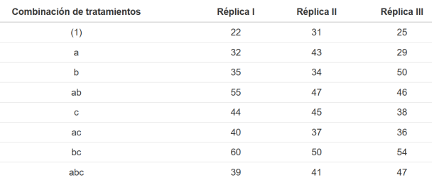

# DISEÑO FACTORIAL 2^3

## EJEMPLO: EFECTOS DE VELOCIDAD DE CORTE

Un ingeniero está interesado en los efectos de la velocidad de corte (A), la geometría de la herramienta (B) y el ángulo de corte (C) sobre la vida (en horas) de una máquina herramienta. Se eligen dos niveles de cada factor y se corren 3 réplicas de un diseño factorial $2^3$. Los resultados fueron los siguientes:

```{r, echo=FALSE, out.width="63%", out.height="63%"}

```

Realizar el análisis estadístico del experimento.

### Preguntas

a) Hallar el efecto de cada factor y de la interacción (realizar alguna explicación o interpretación).
b) Desarrolla e interpreta el análisis de varianza (con sus respectivas pruebas de hipótesis).
c) Genera el modelo de regresión para verificar cumplimiento de supuestos.
d) Comprueba los supuestos.
e) Indique cual seria el modelo de regresión y grafique una superficie de respuesta.

### Solución

a) **Hallar el efecto de cada factor y de la interacción (realizar alguna explicación o interpretación).**

Se muestran las 8 combinaciones con las letras minúsculas: "(1), a, b, ab, c, ac, bc, abc", repliquemos los datos en el R

```{r}
y<-c(22, 32, 35, 55, 44, 40, 60, 39, 31, 43, 34, 47, 45, 37, 50, 41, 25, 29, 50, 46, 38, 36, 54, 47)
A<-rep(c(-1,1),12)
B<-rep(c(rep(-1,2),rep(1,2)),6)
C<-rep(c(rep(-1,4),rep(1,4)),3)
```
Ahora realizamos las diferentes interacciones

```{r}
AB <- A*B
BC <- B*C
AC <- A*C
ABC <- A*B*C 
```

**Veamos el efecto de A**

```{r}
ypA<-tapply(y,A,mean)
ypA
Aefe<-ypA[2]-ypA[1]
Aefe
```

El efecto de A (velocidad de corte) es positivo y pequeño, esto indica que al incrementar la velocidad de corte, se incrementará la vida de la máquina pero no de una gran manera.

**Veamos el efecto de B**

```{r}
ypB<-tapply(y,B,mean)
ypB
Befe<-ypB[2]-ypB[1]
Befe
```

El efecto de B (geometría de la herramienta) es positivo y grande, esto indica que al incrementar la geometría de la herramienta, se incrementará la vida de la máquina de gran manera.

**Veamos el efecto de C**

```{r}
ypC<-tapply(y,C,mean)
ypC
Cefe<-ypC[2]-ypC[1]
Cefe
```

El efecto de C (ángulo de corte) es positivo y grande, esto indica que al incrementar el ángulo de corte, se incrementará la vida de la máquina de gran manera.

**Veamos el efecto de la interacción AB**

```{r}
ypAB<-tapply(y,AB,mean)
ypAB
ABefe<-ypAB[2]-ypAB[1]
ABefe
```

El efecto de la interacción AB (velocidad de corte y geometría de la herramiennta) es negativo y pequeño, esto indica que la interacción entre la velocidad de corte y geometría de la herramienta, disminuirá la vida de la máquina de forma no tan grande.

**Veamos el efecto de la interacción AC**

```{r}
ypAC<-tapply(y,AC,mean)
ypAC
ACefe<-ypAC[2]-ypAC[1]
ACefe
```

El efecto de la interacción AB (velocidad de corte y ángulo de corte) es negativo y grande, esto indica que la interacción entre la velocidad de corte y el ángulo de corte, disminuirá la vida de la máquina de gran manera.

**Veamos el efecto de la interacción BC**

```{r}
ypBC<-tapply(y,BC,mean)
ypBC
BCefe<-ypBC[2]-ypBC[1]
BCefe
```

El efecto de la interacción BC (geometría de la herramienta y ángulo de corte) es negativo y regular, esto indica que la interacción entre la geometría de la herramienta y el ángulo de corte, disminuirá la vida de la máquina.

**Veamos el efecto de la interacción ABC**

```{r}
ypABC<-tapply(y,ABC,mean)
ypABC
ABCefe<-ypABC[2]-ypABC[1]
ABCefe
```

El efecto de la interacción ABC (velocidad de corte, geometría de la herramienta y ángulo de corte) es negativo y regular, esto indica que la interacción entre la velocidad de corte con la geometría de la herramienta y el ángulo de corte, disminuirá la vida de la máquina.

b) **Desarrolla e interpreta el análisis de varianza (con sus respectivas pruebas de hipótesis).**

Obtenemos el modelo

```{r}
mod<-lm(y~A+B+C+ A*B+A*C+B*C + A*B*C)
summary(mod)
```

Se observa en el resumen que se obtienen una significancia en relación a los efectos descritos anteriormente: Influencia del efecto B, C y AC.

Realizemos la suma de cuadrados y ANOVA correspondiente

```{r}
# sumas de cuadrados y ANVA
anva<-aov(mod)
summary(anva)
```

Nos planteamos las siguientes hipótesis:

**Hipótesis sobre la interacción general**

$H_0:$ No existe efecto significativo de la interacción en la vida de la máquina

$H_1:$ Existe efecto significativo de la interacción en la vida de la máquina

$F: 0.934, pvalor = 0.35 > 0.05$ no se rechaza $H_0$

**Conclusión:** No existe un efecto significativo en las interacciones con respecto a la vida de la máquina.

**Hipótesis sobre la interacción entre A y B**

$H_0:$ No existe efecto significativo de la interacción entre la velocidad de corte y geometría de la herramienta

$H_1:$ Existe efecto significativo de la interacción entre la velocidad de corte y geometría de la herramienta

$F: 0.552, pvalor = 0.47 > 0.05$ no se rechaza $H_0$

**Conclusión:** No existe un efecto significativo en la interacción de la velocidads de corte y geometría de la herramienta con respecto a la vida de la máquina.

**Hipótesis sobre la interacción entre A y C**

$H_0:$ No existe efecto significativo de la interacción entre la velocidad de corte y ángulo de corte

$H_1:$ Existe efecto significativo de la interacción entre la velocidad de corte y ángulo de corte

$F: 15.519, pvalor = 0.001 < 0.05$ se rechaza $H_0$

**Conclusión:** Existe un efecto significativo en la interacción de la velocidad de corte y ángulo de corte con respecto a la vida de la máquina.

**Hipótesis sobre la interacción entre B y C**

$H_0:$ No existe efecto significativo de la interacción entre la geometría de la herramienta y ángulo de corte

$H_1:$ Existe efecto significativo de la interacción entre la geometría de la herramienta y ángulo de corte

$F: 1.597, pvalor = 0.22 > 0.05$ no se rechaza $H_0$

**Conclusión:** No existe un efecto significativo en la interacción de la geometría de la herramienta y ángulo de corte con respecto a la vida de la máquina.

**Hipótesis sobre el efecto del factor A**

$H_0:$ No existe efecto significativo del factor velocidad de corte sobre la vida de la máquina

$H_1:$ Existe efecto significativo del factor velocidad de corte sobre la vida de la máquina

$F: 0.022, pvalor = 0.88 > 0.05$ no se rechaza $H_0$

**Conclusión:** No existe un efecto significativo del factor velocidad de corte sobre la vida de la máquina.

**Hipótesis sobre el efecto del factor B**

$H_0:$ No existe efecto significativo del factor geometría de la herramienta sobre la vida de la máquina

$H_1:$ Existe efecto significativo del factor geometría de la herramienta sobre la vida de la máquina

$F: 25.547, pvalor = 0.0001 < 0.05$ se rechaza $H_0$

**Conclusión:** Existe un efecto significativo del factor geometría de la herramienta sobre la vida de la máquina.

**Hipótesis sobre el efecto del factor C**

$H_0:$ No existe efecto significativo del factor ángulo de corte sobre la vida de la máquina

$H_1:$ Existe efecto significativo del factor ángulo de corte sobre la vida de la máquina

$F: 9.287, pvalor = 0.008 < 0.05$ se rechaza $H_0$

**Conclusión:** Existe un efecto significativo del factor ángulo de corte sobre la vida de la máquina.

c) **Genera el modelo de regresión para verificar cumplimiento de supuestos.**

El modelo de regresión que se considera para realizar el chequeo de supuesto está dado por

$$y = \beta_0 + \beta_2 X_2 + \beta_3 X_3 + \beta_5 X_1 X_3$$

Donde:

- $X_1 = -1,$ si la velocidad de corte es 40.67, caso contrario $X_1 = 1,$ si la velocidad de corte es 41
- $X_2 = -1,$ si la geometría de la herramienta es 35.17, caso contrario $X_1 = 1,$ si la geometría de la herramienta es 46.5
- $X_2 = -1,$ si el ángulo de corte es 37.42, caso contrario $X_1 = 1,$ si el ángulo de corte es 44.25

El modelo estaría expresado de la siguiente forma

```{r}
mod1<-lm(y~B+C+A*C)
summary(mod1)
```

El cual el modelo de regresión generado sería el siguiente

$$
Y = 40.83 + 5.67 X_2 + 3.42 X_3 - 4.42 X_1 X_3 
$$

Hallemos los errores para realizar los respectivos supuestos posteriores

```{r}
CME<-deviance(mod1)/df.residual(mod1)
beta1<-coefficients(mod1)
I<-rep(1,length(y))
X<-cbind(I,B,C,A,AC)
yest<-X%*%beta1
e<- y-yest
e

H<-X%*%solve(t(X)%*%X)%*%t(X)
ri<-e/sqrt(CME*(1-diag(H)))
ri

H<-X%*%solve(t(X)%*%X)%*%t(X)
ri<-e/sqrt(CME*(1-diag(H)))
ri
```

d) **Comprueba los supuestos.**

Veamos un gráfico general de los supuestos

```{r}
par(mfrow=c(2,2))
plot(mod1)
```

Se observa que la varianza se mantiene igual indicando que se observa homogeneidad de varianzas y asi mismo también se observa una normalidad en el QQ plot, realizemos los supuestos para corroborar estas hipótesis.

**Supuesto de Normalidad de Residuos**

Nos planteamos la hipótesis

$H_0:$ Los residuos tienen distribución normal

$H_1:$ Los residuos no tienen distribución normal

```{r}
ri<-rstandard(mod1)
shapiro.test(ri)

library(nortest)
ad.test(ri)
```

**Conclusión:** se observa que en la prueba de Shapiro Wilk y Anderson Darling se tienen un $pvalor > 0.05$ por lo que no se rechaza $H_0$ en el que se concluye que los residuos tienen una distribución normal.

**Supuesto de Varianza constante**

Nos planteamos la hipótesis

$H_0:$ La varianza es constante (homogeneidad de varianzas)

$H_1:$ La varianza no es constante (no homogeneidad de varianzas)

```{r}
library(car)
ncvTest(mod1)
```

**Conclusión:** se observa que en la prueba de Breusch Pagan se tienen un $pvalor = 0.79 > 0.05$ por lo que no se rechaza $H_0$ en el que se concluye que se cumple el supuesto de homogeneidad.

e) **Indique cual seria el modelo de regresión y grafique una superficie de respuesta.**

Volvamos a traer el modelo de regresión y generemos el gráfico de superficie.

$$
Y = 40.83 + 5.67 X_2 + 3.42 X_3 - 4.42 X_1 X_3 
$$

**FACTOR B y C**

```{r}
modBC<-function(x2,x3){40.83+5.67*x2+3.42*x3}
x2<-seq(-5,5,0.05)
x3<-seq(-5,5,0.05)
z<-outer(x2,x3,modBC)
par(mfrow=c(1,1))
persp(x2,x3,z,theta=-40,phi=30,ticktype="detailed",
      xlab="factorB",
      ylab="factorC", 
      zlab="y")
```

En el que se observa que la menor vida se encuentran en niveles bajos de B y C