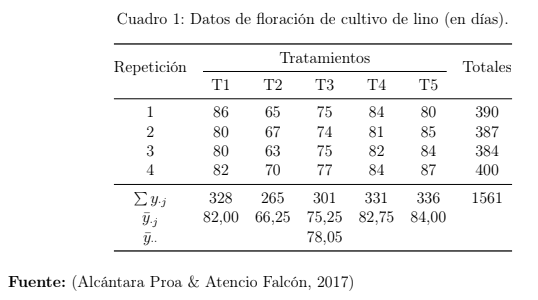

# DCA-Comparaciones múltiples-supuestos

## EJERCICIO

Un grupo de ingenieros agrónomos realizaron una investigación experimental en el fundo Huancayo en el distrito de Huariaca, provincia Pasco, región Pasco, en condiciones de campo con el fin de determinar el efecto de cinco fertilizantes complejos en días de floración del cultivo de lino _(Linum usitatissimum)_

**Descripción de los tratamientos (fertilizantes)**

- $T1:$ YaraVera AMIDAS
- $T2:$ YaraMila COMPLEX
- $T3:$ YaraTera KRISTA K
- $T4:$ N20, P20, K20
- $T5:$ N18, P15, K10

```{r, echo=FALSE, out.width="63%", out.height="63%"}

```

### Preguntas

a) Plantee y describa el modelo que considere adecuado para analizar este caso.
b) ¿Se puede afirmar que al menos uno de los días de floración difiere del resto al aplicar los distintos fertilizantes complejos?
c) Verifique si el modelo propuesto cumple con los supuestos.
d) Estime el coeficiente de variabilidad.
e) ¿Cuáles son los fertilizantes que tienen mejor efecto en la floración media en el cultivo de lino?
f) ¿El tiempo promedio de floración al aplicar el fertilizante $T3$ es superior al aplicar el fertilizante $T2$ en más de 2 días?
g) Al aplicar los fertilizantes $T2$ y $T3$ (en forma conjunta), ¿el tiempo medio en hacer efecto la floración es menor que al aplicar los fertilizantes $T4$ y $T5$ (en forma conjunta)?

**Indicaciones finales**

a) El documento debe utilizar un lenguaje académico.
b) Subir el informe final-documento en pdf.
c) Subir el Script y data comprimido (se descontaran puntos).
d) Subir tu informe antes de las 13:00 pm (07-09-2025)


### Solución

a) **Plantee y describa el modelo que considere adecuado para analizar este caso.**

Tomando en cuenta el contexto en el que solo se desea evaluar el efecto de cinco fertilizantes, el modelo adecuado a utilizar es un diseño completo al azar. En las cuales se tienen los tratamiento de los distintos fertilizantes, si evaluamos el estudio original indica que se utiliza el diseño bloque completo al azar, en donde las repeteciones vienen a ser los bloques.

El modelo aditivo lineal es el siguiente

$${Y}_{ij}=\mu + {\tau}_{i}+{\epsilon}_{ij}$$

Donde:

- ${Y}_{ij}$ Es la floración de _(Linum usitatissimum)_ del i-ésimo tratamiento y j-ésima repetición.
- $\mu$ es el efecto de la media general en la floración de _(Linum usitatissimum)_.
- ${\tau}_{i}$ es el efecto del i-ésimo tratamiento.
- ${\epsilon}_{ij}$ es el efecto del error experimental en el i-ésimo tratamiento y j-ésima repetición. para $i = \{1,2,3,4,5\}$ tratamientos y $j = \{1,2,3,4\}$ repeticiones. Además, el modelo asume que ${\epsilon}_{ij} \sim N(0,{\sigma}^{2})$

b) **¿Se puede afirmar que al menos uno de los días de floración difiere del resto al aplicar los distintos fertilizantes complejos?**

Empezemos desarrollando los datos del archivo Excel que también se adjuntará en el trabajo, para posteriormente hacer la lectura del archivo.

```{r}
library(readxl)
library(here)
data <- read_excel(here("11 Diseno Experimentos/Trabajo 1/data_floracion.xlsx"))
head(data)
```

```{r}
attach(data) # Para tomar los datos
data$tratamiento  = as.factor(tratamiento) # convierte tratamiento en factor
```

Empezemos viendo un gráfico de la dispersión y el efecto de los tratamientos en la floración del cultivo de _(Linum usitatissimum)_

```{r}
library(ggplot2)
ggplot(data, aes(x = tratamiento, y = floracion, fill = tratamiento)) +
  geom_violin(alpha = 0.5) +
  theme(legend.position = "none")+
  geom_boxplot(width = 0.2)
```

**Interpretación:** Se observa que el YaraMila COMPLEX presenta la menor floración de _(Linum usitatissimum)_, seguido del YaraTera KRISTA K. Seguidamente los tratamientos: YaraVera AMIDAS, (N20, P20, K20), (N18, P15, K10) presentan la mayor floración de _(Linum usitatissimum)_ sin mostrar diferencias entre ellos.

Veamos la media general

```{r}
med_general = mean(floracion); med_general
```

Ahora la media de los tratamientos

```{r}
library(dplyr)
med_trat = aggregate(floracion~tratamiento, FUN = mean)
med_trat%>% rename(Media = floracion) %>% mutate(Efecto = Media-med_general)
```

Se observa que el tratamiento que tiene el menor efecto en la floración de _(Linum usitatissimum)_ es YaraMila COMPLEX y el que presenta el mayor efecto es (N18, P15, K10)

Ahora definamos el modelo

```{r}
mod.dca = lm(floracion ~ tratamiento) # modelo DCA
```

Y veamos el análisis de la varianza para afirmar que al menos uno de los días de floración difiere del resto al aplicar los distintos fertilizantes complejos.

```{r}
summary(aov(mod.dca)) # Análisis de varianza
```

Efectivamente, se puede afirmar que al menos uno de los días de floración de _(Linum usitatissimum)_ difiere del resto al aplicar los distintos fertilizantes complejos. Ya que existe evidencia suficiente para rechazar la hipótesis nula que indica que los días de floración de _(Linum usitatissimum)_ no difieran en los tratamientos complejos.

c) **Verifique si el modelo propuesto cumple con los supuestos.**

- **Normalidad de errores**

Nos planteamos las hipótesis
$H_0:$ Los errores se distribuyen normalmente
$H_1:$ Los errores no se distribuyen normalmente

Veamos los residuales del modelo

```{r}
library(agricolae)
residuales = residuals(mod.dca) # extrae residuales
histo      = hist(residuales, col="gold", xlab="residuales", main="Histograma de los residuales", ylab="Densidad",prob=1)
normal.freq(histo, frequency=3) # densidad
```

Se observa que los errores se distribuyen a una normal, veamos el QQ-plot

```{r}
plot(mod.dca, which = 2)
```

A excepción de unos valores, la mayor parte se centra a la recta de residuales, veamos ahora la prueba de Shapiro-Wilk de normalidad de residuos

```{r}
shapiro.test(residuales)
```

Como se tiene un pvalor $> 0.05$ no se rechaza $H_0$ lo cual indica que el modelo cumple el supuesto de normalidad de errores.

- **Homocedasticidad**

Nos planteamos las hipótesis:
$H_0:$ Existe homogeneidad de varianzas
$H_1:$ No existe homogeneidad de varianzas

Veamos si la variabilidad es distinta en los factores

```{r}
plot(mod.dca, which = 5)
```

Y si la variabilidad se incrementa con la media general

```{r}
plot(mod.dca, which = 1)
```

Se observa que la varianza se mantiene constante en los residuos. Utilizemos la prueba de Breusch-Pagan para evaluar este supuesto

```{r}
library(car)
ncvTest(mod.dca)
```

Como el pvalor $>0.05$ no se rechaza $H_0$ en lo cual se indica que la varianza es constante en los residuos, por lo que se cumple el supuesto de homocedasticidad.

- **Independencia de errores**

Para ver la no autocorrelación de los errores nos planteamos las hipótesis
$H_0:$ Existe independencia de errores
$H_1:$ No existe independencia de errores

Veamos de forma gráfica la autocorrelación de los errores

```{r}
plot(residuals(mod.dca), pch = 18,
     type = "b", ylab = "residuales",
     xlab = "Índice", main="Residuales")
abline(h=0)
```

No se observa un patrón de dependencia en los errores, realizemos la prueba de Durbin-Watson

```{r}
library(lmtest)
dwtest(mod.dca,alternative = c("two.sided"))
```

Como el pvalor $>0.05$ no se rechaza $H_0$ lo cual indica que existe independencia de errores o no están autocorrelacionados de primer orden, lo cual indica que se cumple el supuesto de independencia de errores.

d) **Estime el coeficiente de variabilidad.**


e) **¿Cuáles son los fertilizantes que tienen mejor efecto en la floración media en el cultivo de lino?**
f) **¿El tiempo promedio de floración al aplicar el fertilizante $T3$ es superior al aplicar el fertilizante $T2$ en más de 2 días?**
g) **Al aplicar los fertilizantes $T2$ y $T3$ (en forma conjunta), ¿el tiempo medio en hacer efecto la floración es menor que al aplicar los fertilizantes $T4$ y $T5$ (en forma conjunta)?**
