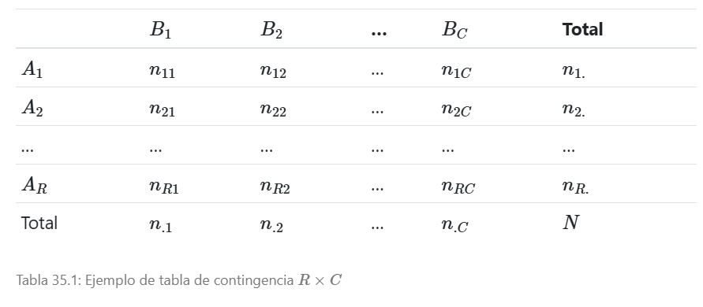

# Ejercicios AFE, Cluster y análisis de correspondencia múltiple

## CASO 1: Postulantes (6 puntos)

Se tienen datos de las notas de alumnos postulantes a un colegio de alto rendimiento, se desea agrupar las notas de los cursos y ver que grupos podrían haber de cursos.

Las notas de los siguientes cursos son Razonamiento verbal, Razonamiento matemático, Matemáticas, Psicología y filosofía, Física, Lógica, Biología, Historia y Química.

Archivo a utilizar **postulantes.sav**

```{r, warning=FALSE, echo=FALSE, include=FALSE}
library(here)
```

```{r}
library(foreign)
postulantes <- read.spss(here("9 Analisis Multivariado/Trabajo 3/Postulantes.sav"),
                 to.data.frame = TRUE,
                 use.value.labels = TRUE)
```

a) Realizar análisis factorial exploratorio
b) Decida cuantos factores retener explique el por qué.
c) Decida el método de rotación y explique el por qué.
d) Explicar los resultados y de sus conclusiones del ejercicio.

### Solución

a) **Realizar análisis factorial exploratorio**

Veamos un resumen de los datos

```{r}
summary(postulantes)
```

No se tienen datos vacíos por lo cual no es necesario realizar una técnica de imputación, por lo que empezemos omitiendo la primera columna que representa a los códigos de los postulantes

```{r}
postulantes <- postulantes[,-1]
```

#### Prueba de esfericidad de Bartlet

```{r}
library(psych)
cortest.bartlett(cor(postulantes), n=nrow(postulantes))
```

Se nos muestra un p valor menor a 0.05, justifica el uso de reducción de datos.

#### Indicador Kaiser-Meyer-Olkinn KMO y MSA

```{r}
KMO(postulantes)
```

Los valores son menores a 0.5 a excepción de PSI (Psicología) por lo que se puede extraer para que se considere aceptable la aplicación del análisis factorial al conjunto de datos

```{r}
data_AFE <- postulantes[,-4] 
```

Veamos nuevamente el test de bartlet y KMO

```{r}
cortest.bartlett(cor(data_AFE), n=nrow(data_AFE))
```

Significativo, ahora veamos el KMO

```{r}
KMO(data_AFE)
```

Ahora si es justificable el uso de un análisis factorial exploratorio

b) **Decida cuantos factores retener explique el por qué.**

Empezemos realizando la primera seleccionando tomando en cuenta todos los factores

```{r}
facto=principal(r=data_AFE,nfactors=8,rotate="none")
facto
facto$loadings
```

Por la mayor explicación de la varianza, se recomienda usar 3 o 4 factores. Decidamos el uso de 4 factores

c) **Decida el método de rotación y explique el por qué.**

Teniendo en cuenta que se tendrán 4 factores veamos las cargas factoriales

```{r}
facto=principal(r=data_AFE,nfactors=4,rotate="none")
facto
facto$loadings
```

Vemos que las cargas aportan a cada factor siendo posible su distinción entre factores teniendo los siguientes resultados

- PC1: **RM (confuso)**, MAT, FIS, BIO **HIS (confuso)** y QUI
- PC2: RV, **HIS (confuso)**
- PC3: LOG
- PC4: **RM (confuso)** y BIO

Siendo casos en donde no se observan las diferencias de una variable hacia el factor, por lo que es necesario explicar la máxima varianza, veamos con varimax

```{r}
facto=principal(r=data_AFE,nfactors=4,rotate="varimax")
facto
facto$loadings
```

Veamos ahora los factores, asimismo como su importancia

- RC1: FIS, BIO y QUI
- RC2: RV e HIS
- RC4: RM, MAT
- RC3: LOG

```{r}
biplot(prcomp(data_AFE, scale = FALSE))
abline(h = 0, v = 0, lty = 2, col = 8)
```

Como se observa hay mejor distinción de las variables con respecto a sus factores asimismo podemos explicar cada factor de la siguiente manera

- **RC1 (Ciencias naturales):** Conformada por Física, biología y química
- **RC2 (Comprensión información):** Conformada por razonamiento verbal e historia
- **RC4 (Ciencias matemáticas):** Conformada por razonamiento matemático y matemáticas
- **RC3 (Lógica):** Conformada por lógica

Concluyendo que la rotación varimax permite una mejor distinción entre factores a través de la explicación de su varianza máxima asimismo como los componentes creados tienen lógica con el contexto del ejercicio.

d) **Explicar los resultados y de sus conclusiones del ejercicio.**

Saquemos ahora los scores

```{r}
scores <- as.matrix(data_AFE) %*% as.matrix(facto$loadings)
scores <- data.frame(scores) ; head(scores)
```

Realizemos una transformación manteniendo sus características

```{r}
Zscores<-scale(scores)
transScore <- Zscores*100+500 # Proceso de baremación de PISA
transScore <- data.frame(transScore)
```

Recodifiquemos para la interpretación

#### RC1 (Ciencias naturales)

```{r}
transScore$RNC1[transScore$RC1<350] <-1
transScore$RNC1[transScore$RC1>=350 & transScore$RC1<450] <-2
transScore$RNC1[transScore$RC1>=450 & transScore$RC1<550] <-3
transScore$RNC1[transScore$RC1>=550 & transScore$RC1<650] <-4
transScore$RNC1[transScore$RC1>=650] <-5


# Etiquetar
transScore$RNC1 <- factor(transScore$RNC1, 
                             labels = c("Pesima", "Mala", "Regular",
                                        "Buena", "Excelente"))


fi=table(transScore$RNC1)
probabilidad=prop.table(table(transScore$RNC1))*100
cbind(fi,probabilidad)
barplot(prop.table(table(transScore$RNC1)), col = "darkBlue", xlab = "Ciencias naturales")

```

Se observa que la mayor parte se encuentra en un nivel regular y bueno en la parte de ciencias naturales, seguido de malos y pésimos y por último una pequeña parte tiene notas excelentes en las ciencias naturales.

#### RC2 (Comprensión de la información)

```{r}
transScore$RNC2[transScore$RC2<350] <-1
transScore$RNC2[transScore$RC2>=350 & transScore$RC2<450] <-2
transScore$RNC2[transScore$RC2>=450 & transScore$RC2<550] <-3
transScore$RNC2[transScore$RC2>=550 & transScore$RC2<650] <-4
transScore$RNC2[transScore$RC2>=650] <-5


# Etiquetar
transScore$RNC2 <- factor(transScore$RNC2, 
                             labels = c("Pesima", "Mala", "Regular",
                                        "Buena", "Excelente"))


fi=table(transScore$RNC2)
probabilidad=prop.table(table(transScore$RNC2))*100
cbind(fi,probabilidad)
barplot(prop.table(table(transScore$RNC2)), col = "darkBlue", xlab = "Comprension de la informacion")

```

Se observa que respecto a comprension de la información la mayor parte se encuentra en un nivel regular, seguido de bueno, mala, pésima y una pequeña parte en el nivel excelente.

#### RC4 (Ciencias matemáticas)

```{r}
transScore$RNC4[transScore$RC4<350] <-1
transScore$RNC4[transScore$RC4>=350 & transScore$RC4<450] <-2
transScore$RNC4[transScore$RC4>=450 & transScore$RC4<550] <-3
transScore$RNC4[transScore$RC4>=550 & transScore$RC4<650] <-4
transScore$RNC4[transScore$RC4>=650] <-5


# Etiquetar
transScore$RNC4 <- factor(transScore$RNC4, 
                             labels = c("Pesima", "Mala", "Regular",
                                        "Buena", "Excelente"))


fi=table(transScore$RNC4)
probabilidad=prop.table(table(transScore$RNC4))*100
cbind(fi,probabilidad)
barplot(prop.table(table(transScore$RNC4)), col = "darkBlue", xlab = "Ciencias matemáticas")

```

Se observa que la mayor parte se encuentra en un nivel regular y bueno, seguido de malo y pésimo, y una pequeña parte tiene un término excelente con respecto a los resultados enfocados a las ciencias matemáticas.

#### RC3 (Lógica)

```{r}
transScore$RNC3[transScore$RC3<350] <-1
transScore$RNC3[transScore$RC3>=350 & transScore$RC3<450] <-2
transScore$RNC3[transScore$RC3>=450 & transScore$RC3<550] <-3
transScore$RNC3[transScore$RC3>=550 & transScore$RC3<650] <-4
transScore$RNC3[transScore$RC3>=650] <-5


# Etiquetar
transScore$RNC3 <- factor(transScore$RNC3, 
                             labels = c("Pesima", "Mala", "Regular",
                                        "Buena", "Excelente"))


fi=table(transScore$RNC3)
probabilidad=prop.table(table(transScore$RNC3))*100
cbind(fi,probabilidad)
barplot(prop.table(table(transScore$RNC3)), col = "darkBlue", xlab = "Lógica")

```

Se observa que respecto a lógica la mayor parte se encuentra en un nivel regular, seguido de bueno, mala, pésima y una pequeña parte en el nivel excelente.

## CASO 2: Agrupando clientes mayoristas (7 puntos):

El conjunto de datos se refiere a los clientes de un distribuidor mayorista de Portugal, el cual comercializa distintos tipos de productos.

Cada una de las observaciones hace referencia a un cliente distinto, el cual incluye el gasto anual en unidades monetarias (u.m.) para cada una de las categorías.

Se nos solicita realizar un análisis clúster que nos permita agrupar a nuestros clientes en función de los distintos tipos de productos que adquirieron, para lo cual contamos:

| Variable            | Descripción                                                                |
|---------------------|----------------------------------------------------------------------------|
| `Channel`           | Canal de clientes: 1. Horeca (Hotel/Restaurante/Café) 2. Canal Minorista   |
| `Región`            | Región de los clientes: 1. Lisboa, 2. Oporto y 3. Otra                     |
| `Fresh`             | Gasto anual en productos frescos.                                          |
| `Milk`              | Gasto anual en productos lácteos.                                          |
| `Grocery`           | Gasto anual en productos comestibles.                                      |
| `Frozen`            | Gasto anual en productos congelados.                                       |
| `Detergent_Papers`  | Gasto anual en detergentes y productos de papel.                           |
| `Delicatessen`      | Gasto anual en productos preparados (snacks y licor).                      |

Los datos se encuentran en el archivo "clientes.csv".

```{r}
clientes <- read.csv(here("9 Analisis Multivariado/Trabajo 3/clientes.csv"))
```


Luego de cargar el conjunto de datos en R, realizar las 2 opciones que se presenta:

**Opción 1**:

1. Generar un nuevo dataset solo con las variables numéricas y estandarizarlas.
2. Generar el agrupamiento por particiones utilizando el método kmeans con k=4.
3. Añadir el dataset original la columna cluster, que identificará a los grupos que obtuvimos mediante esta metodología.
4. Graficar y perfilar a nuestros clientes según su agrupación.

**Opción 2**:

1. Generar un nuevo dataset solo con las variables numéricas y estandarizarlas.
2. Encuentre ahora los clusters de forma jerárquica, calculando la matriz de distancias euclidianas y seleccionando en enlace que creas mejor se ajuste a los datos.
3. Comparar los métodos de enlace y determinar cuál es el adecuado.
4. Generar el nuevo agrupamiento jerárquico con el enlace seleccionado.
5. Graficar el dendograma respectivo y determinar el número de clusters.
6. Graficar y perfilar a nuestros clientes según su agrupación jerárquica.

### Solución

**Opción 1**:

1. **Generar un nuevo dataset solo con las variables numéricas y estandarizarlas.**

Carguemos las librerias a utilizar

```{r}
library(cluster)
library(factoextra)
library(fpc)
```

Veamos un resumen de los datos

```{r}
summary(clientes)
```

Por la descripción mostrada, las variables Channel y region son variables cualitativas, por lo que se deben quitar estas variables para realizar el análisis

```{r}
clientes_num <- clientes[,c(-1,-2)]
```

Ahora estandarizemos

```{r}
clientes_num_estan <- scale(clientes_num)
head(clientes_num_estan)
```

2. **Generar el agrupamiento por particiones utilizando el método kmeans con k=4.**

```{r}
res<-kmeans(clientes_num_estan,4)
res
```

3. **Añadir el dataset original la columna cluster, que identificará a los grupos que obtuvimos mediante esta metodología.**

```{r}
clientes.new<-cbind(clientes,res$cluster)
colnames(clientes.new)<-c(colnames(clientes.new[,-length(clientes.new)]), "cluster.km")
```

4. **Graficar y perfilar a nuestros clientes según su agrupación.**

```{r}
plotcluster(clientes,res$cluster)

clusplot(clientes,res$cluster, color = TRUE,
         shade = TRUE, labels =5,lines=0,
         main ="Gráfico de Conglomerados")
```

```{r}
# Tabla de medias
med <- aggregate(x = clientes.new[,3:8],by = list(clientes.new$cluster.km),FUN = mean)
med

# Describir variables
par(mfrow=c(2,3))
for (i in 3:8) {
  boxplot(clientes.new[,i]~clientes.new$cluster.km, main=names(clientes.new[i]), type="l")
}
```

Mediante los resultados del cluster y el diagrama de cajas podemos extraer las siguientes conclusiones

- **Cluster 1:** Conformado por los clientes que piden mayormente productos comestibles, detergentes y productos de papel. Por lo que puede ser como restaurantes o abarrotes, la mejor estrategia es organizar las ofertas de estos clientes y ofrecerlos descuentos en base a sus preferencias.
- **Cluster 2:** Se diría que este es el dato atípico del análisis ya que viene a ser un único cliente con preferencias en productos lácteos, congelados y preparados de snacks y licor (Da un poco de temor al extraer conclusiones a priori) sería verificar la información de este cliente.
- **Cluster 3:** Conformado por los clientes que no sobresalen en la adquisición de productos ya que en todos se mantienen sus valores en niveles bajos, por lo que podrían ser casos de clientes sin preferencias.
- **Cluster 4:** Conformado por los clientes que piden mayormente productos frescos y congelados. Dando idea a que puedan ser características de clientes relacionados a temas de almacen o distribución. De la misma forma que el cluster 1 sería organizar las ofertas de estos clientes y ofrecerles descuentos en base a sus preferencias.

**Opción 2**:

1. **Generar un nuevo dataset solo con las variables numéricas y estandarizarlas.**

Usemos el mismo dataset generado en el anterior apartado

```{r}
head(clientes_num_estan)
```

2. **Encuentre ahora los clusters de forma jerárquica, calculando la matriz de distancias euclidianas y seleccionando en enlace que creas mejor se ajuste a los datos.**

Empezemos calculando la matriz de distancias

```{r}
distancias <- dist(clientes_num_estan, method = "euclidean") ; head(distancias)
```

Realizemos el cluster de forma jerarquica aglomerativa usando el enlace de Ward

```{r}
res.hc=hclust(distancias,method="ward.D")
plot(res.hc)
```

3. **Comparar los métodos de enlace y determinar cuál es el adecuado.**

```{r}
# Usando el enlace simple
res.hc=hclust(distancias,method="ward.D")
plot(res.hc)

res.hc=hclust(distancias,method="single")
plot(res.hc)

res.hc=hclust(distancias,method="complete")
plot(res.hc)

res.hc=hclust(distancias,method="average")
plot(res.hc)

res.hc=hclust(distancias,method="centroid")
plot(res.hc)
```

El que mas distingue a los cluster es por el enlace de Ward

4. **Generar el nuevo agrupamiento jerárquico con el enlace seleccionado.**

```{r}
res.hc=hclust(distancias,method="ward.D")
```


5. **Graficar el dendograma respectivo y determinar el número de clusters.**

Usemos el índice de Silueta

```{r, fig.width=13, fig.height=13}
par(mfrow=c(1,3))
for(h in 2:6){
  conglomerados=cutree(res.hc,k=h)
  plot(silhouette(conglomerados,distancias))
}
par(mfrow=c(1,1))
```

Por el indice de silueta indica que es mejor tener dos cluster

6. **Graficar y perfilar a nuestros clientes según su agrupación jerárquica.**

Realizemos el corte y grafiquemos

```{r}
res.hc2=cutree(res.hc, k=2)
fviz_dend(res.hc, cex = 0.6, k = 2, palette = "jco")
```

Se observa que en la primera parte se encuentra una pequeña parte de clientes, especialmente a aquellos que se deben obviar del primer grupo

## CASO 3: (7 puntos)

Investigar y realizar un informe monográfico sobre el **_análisis de correspondencia múltiple_** adjuntar un ejercicio aplicando R o Phyton.

### Solución

El trabajo es extraido del trabajo de [@adrian2021] y [@fernandez2024] en el que se considero las partes esenciales para el desarrollo de la presente monografía

#### Resumen

El análisis múltiple de correspondencia (AMC) es una técnica exploratoria utilizada para visualizar la relación entre más de dos variables categóricas, el caso de solo dos variables es el análisis de correspondencias o análisis de correspondencia simple. Para usar en R se necesita la librería `FactoMineR`. El AMC es útil para identificar coocurrencias entre categorías sin necesidad de tener una variable independiente y puede complementarse con el análisis de clúster para agrupar elementos derivados del análisis.

#### Metodología

Generalmente parte de una tabla de contingencia que se muestra a continuación

```{r, echo=FALSE, out.width="100%"}

```

Dada una tabla de contingencia, a partir de las frecuencias observadas $n_{ij}$, se definen las distancias entre perfiles

- Para los perfiles fila, $d_{ii^{'}}=\sum_{j=1}^C \frac{1}{n_{.j}} {\left(\frac{n_{ij}}{n_{i.}} - \frac{n_{i^{'}j}}{n_{i^{'}.}} \right)}^2$
- Para los perfiles columna, $d_{jj^{'}}=\sum_{i=1}^R \frac{1}{n_{i.}} {\left(\frac{n_{ij}}{n_{.j}} - \frac{n_{ij^{'}}}{n_{.j^{'}}} \right)}^2$

Cuanto más se diferencien unos perfiles de otros, más grandes serás las diferencias anteriores. El análisis de correspondencias busca construir **dimensiones** (habitualmente, de dos) y obtener las coordenadas de los niveles de ambos factores en dichas dimensiones:

$$
\mathbf{A}=({\mathbf{a}}_{1} \quad {\mathbf{a}}_{2} \quad \cdots \quad {\mathbf{a}}_{R})
$$

Con ${\mathbf{a}}_{i} = \begin{pmatrix}
{a}_{i1} \\
{a}_{i2}
\end{pmatrix}$ y

$$
\mathbf{B}=({\mathbf{b}}_{1} \quad {\mathbf{b}}_{2} \quad \cdots \quad {\mathbf{b}}_{C})
$$

Con ${\mathbf{a}}_{j} = \begin{pmatrix}
{b}_{j1} \\
{b}_{j2}
\end{pmatrix}$

siendo ${\mathbf{a}}_{i}$ las coordenadas del nivel fila ${\mathbf{A}}_{i}$ y ${\mathbf{b}}_{j}$ las del nivel columna ${\mathbf{B}}_{j}$ en el plano, de forma que reproduzcan las distancias entre perfiles y columna y los residuos estandarizados (asociaciones):

$$
d({\mathbf{a}}_{i},{\mathbf{a}}_{i^{'}}) = \sqrt{{({a}_{i1}-{a}_{i^{'}1})}^{2}+{({a}_{i2}-{a}_{i^{'}2})}^{2}} \approx {d}_{ii^{'}},
$$
$$
d({\mathbf{b}}_{j},{\mathbf{b}}_{j^{'}}) = \sqrt{{({b}_{j1}-{b}_{j^{'}1})}^{2}+{({b}_{j2}-{b}_{j^{'}2})}^{2}} \approx {d}_{jj^{'}},
$$

$$
\mathbf{a}_{i}^{'} \mathbf{b}_{j} \approx r_{ij}
$$

Una vez en disposición de las coordenadas contenidas en las matrices $\mathbf{A}$ y $\mathbf{B}$ es posible "visualizar" la posición relativa de cada factor en las nuevas dimensiones. Esta estructura permite ver tanto las "distancias" que hay entre los niveles de cada factor (mediante la distancia de representación en el plano) como las "asociaciones" entre niveles de ambos factores (ya que mientras más asociación haya, más cerca se representarán en el plano).

Para resolver el problema de la estimación de las matrices $\mathbf{A}$ y $\mathbf{B}$ se lleva a cabo una descomposición de la matriz $\mathbf{R} = ( r_{ij} )$ en valores singulares.

Según la importancia que se dé al ajuste de uno de los perfiles o a la matriz de residuos, se tienen diferentes métodos de selección, llamados **normalizaciones**.

**Proyecciones fila, columna y simétrica**

El punto de partida es la matriz de frecuencias relativas $\mathbf{F}$, cuyas entradas son $f_{ij}=n_{ij}/N$, también llamada matriz de correspondencias. Definiendo el vector de unos, $\mathbf{1}$, con la dimensión adecuada, las masas, o frecuencias marginales, de filas y columnas, $r_{i} = f_{i} = \sum_{j=1}^C f_{ij}$ y $c_{.j}=f_{.j}=\sum_{i=1}^R f_{ij}$, respectivamente, se pueden expresar matricialmente como $\mathbf{r}=\mathbf{F1}$ y $\mathbf{c}=\mathbf{F^{'}1}$ o, en forma de matrices diagonales, como:

$$
\mathbf{D}_{R} = diag(r) \equiv diag(r_1 , \cdots,r_{R}) \text{ y } \mathbf{D}_{C} = diag(c) \equiv diag(c_1 , \cdots,c_{C})
$$

Se calcula la **_matriz de residuos estandarizados_** como:

$$
\mathbf{R}_{est} = {\mathbf{D}}_{R}^{-\frac{1}{2}} (\mathbf{F} - \mathbf{rc^{'}}) {\mathbf{D}}_{C}^{-\frac{1}{2}}
$$

La matriz $\mathbf{R}_{est}$ se descompone en valores singulares, calculando las matrices $\mathbf{U}$, $\mathbf{D}$ y $\mathbf{V}$ tales que:

$$
\mathbf{R} = \mathbf{UDV^{'}},
$$
$$
\mathbf{UU^{'}} = \mathbf{V^{'}V}=\mathbf{I}, \quad {\mathbf{U}}_{(RxK)}, \quad {\mathbf{V}}_{(CxK)}
$$
$$
K = min(R-1, C-1)
$$
$$
\mathbf{D} = diag({\mu}_{1}, \cdots, {\mu}_{K}),
$$

Donde los ${\mu}_{i}$ son los **_valores singulares_** (autovectores), estando ordenados de forma decreciente ${\mu}_{1} \geq {\mu}_{2} \geq \cdots \geq {\mu}_{K}$. A partir de la descomposición se pueden obtener:

- Las coordenadas estándar de las filas, $\Phi={\mathbf{D}}_{R}^{-\frac{1}{2}} \mathbf{U}$ y sus coordenadas principales, $\mathbf{H} = \Phi \mathbf{D}$.
- Las coordenadas estándar de las columnas, $\Gamma={\mathbf{D}}_{C}^{-\frac{1}{2}} \mathbf{V}$ y sus coordenadas principales, $\mathbf{G} = \Gamma \mathbf{D}$.
- Las inercias principales, ${\lambda}_{i} = {\mu}_{i}^{2}$.

Las coordenadas estándar permiten representar los perfiles en un plano, pero no permiten una comparación fácil entre perfiles fila columna. Para evitar este efecto, se escalan, dando lugar a las coordenadas principales, utilizadas para definir las proyecciones fila y proyecciones columna, que representan los correspondientes perfiles, formando los llamados mapas asimétricos. Las inercias principales indican el grado de variabilidad entre los perfiles fila o columna y los respectivos vectores de medias, por lo que tienen una interpretación equivalente a la variabilidad explicada por cada componente principal en el análisis de componentes principales.

Por último, las matrices $\mathbf{A} = \mathbf{D}_{R}^{-\frac{1}{2}}\mathbf{UD}$ y $\mathbf{B} = \mathbf{D}_{C}^{-\frac{1}{2}}\mathbf{VD}$ representan las coordenadas de ambos perfiles en un espacio común, llamado mapa simétrico.


#### Ejemplo de aplicación con R

Se usará la base de datos **_Fonocortesía_**

_Base de datos recogida para el proyecto Fonocortesía, dirigida por el catedrático Antonio Hidalgo Navarro en el marco del proyecto de investigación Fonocortesía, subvencionado por Ministerio de Ciencia, Innovación y Universidades (FFI2009-07034)._

# Referencias


